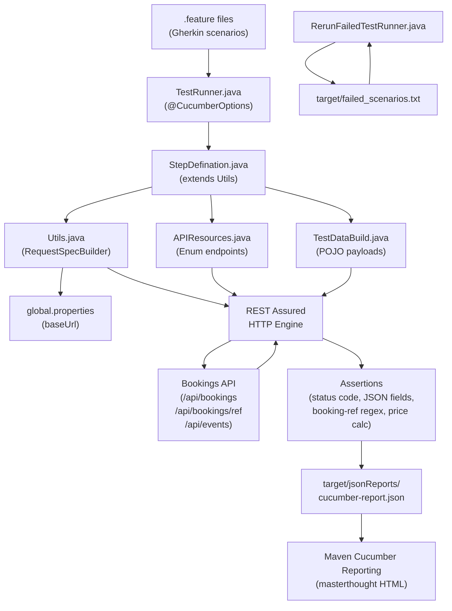
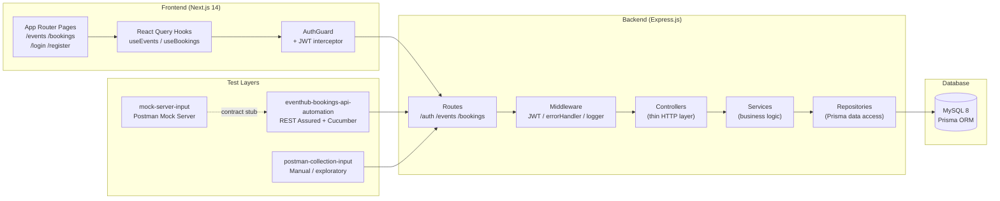
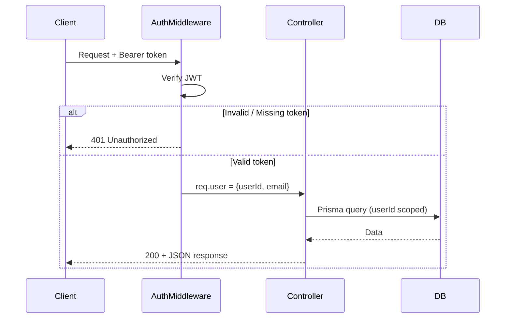

# EventHub — REST Assured BDD API Automation Framework

[](https://openjdk.org/projects/jdk/21/)
[](https://maven.apache.org/)
[](https://rest-assured.io/)
[](https://cucumber.io/)
[](https://junit.org/junit4/)
[](https://www.microsoft.com/windows)
[](LICENSE)

---

## Table of Contents

1. [Overview](#overview)
2. [Demo](#demo)
3. [Quick Start](#quick-start)
4. [Prerequisites](#prerequisites)
5. [Tech Stack](#tech-stack)
6. [Architecture Diagram](#architecture-diagram)
7. [Folder Structure](#folder-structure)
8. [Agentic AI Workflow](#agentic-ai-workflow)
9. [How to Run](#how-to-run)
10. [ROI & Comparison](#roi--comparison)
11. [Troubleshooting](#troubleshooting)
12. [Contributing](#contributing)
13. [Changelog](#changelog)

---

## Overview

This repository contains **two layers of testing** built on top of the **EventHub** full-stack platform — an event ticket booking system (Next.js 14 + Express.js + MySQL).

| Layer | Purpose |
|-------|---------|
| **`eventhub-bookings-api-automation/`** | REST Assured + Cucumber BDD framework for the EventHub Bookings API (create / list / get / cancel bookings) |
| **`postman-collection-input/`** | Postman collections, environments, and globals for exploratory/manual API testing |
| **`mock-server-input/`** | Postman mock server setup for contract testing without hitting the real backend |
| **`backend/`** | EventHub Express.js REST API (Node.js + Prisma + MySQL) |
| **`frontend/`** | EventHub Next.js 14 App Router UI |

The BDD framework follows a **Gherkin-first** approach: plain-English `.feature` files drive test execution through step definitions wired to REST Assured request specs.

---

## Demo

### Cucumber HTML Report (masterthought)

```
target/cucumber-html-reports/cucumber-html-reports/overview-features.html
```

Open the file in any browser after running `mvn verify` inside `eventhub-bookings-api-automation/`.

### Tags Available

| Tag | Scenarios |
|-----|-----------|
| `@Bookings` | Core booking flows — create, list, get by ID/ref, cancel |
| `@HappyPath` | Successful create/list/get/cancel paths |
| `@NeedsBooking` | Scenarios that depend on a freshly created booking (auto-set up via hooks) |
| `@CancelBooking` | Cancel booking, then verify a second cancel returns 404 |
| `@Negative` | Invalid quantity, missing fields, non-existent booking |
| `@Security` | Unauthenticated request returns 401 |
| `@Regression` | Full regression suite (all tags) |

---

## Quick Start

```bash
# 1 — Clone the repo
git clone https://github.com/samirjagtap4030/eventhub-restassured-bdd.git
cd eventhub-restassured-bdd

# 2 — Configure base URL
#     Edit: eventhub-bookings-api-automation/src/test/java/resources/global.properties
#     Set: baseUrl=<your-api-server>

# 3 — Run all BDD tests
cd eventhub-bookings-api-automation
mvn clean verify

# Report opens at:
# target/cucumber-html-reports/cucumber-html-reports/overview-features.html
```

---

## Prerequisites

| Tool | Version | Download |
|------|---------|----------|
| Java (JDK) | 21+ | https://adoptium.net |
| Apache Maven | 3.8+ | https://maven.apache.org/download |
| IDE | IntelliJ IDEA / VS Code | Optional |
| Node.js | 18+ (for backend/frontend only) | https://nodejs.org |
| MySQL | 8.0+ (for backend only) | https://dev.mysql.com/downloads |

> **Minimum to run API tests**: Java 21 + Maven only. Node.js and MySQL are needed only if you also start the EventHub backend locally.

---

## Tech Stack

### API Automation Layer

| Technology | Version | Role |
|-----------|---------|------|
| Java | 21 | Language |
| Apache Maven | 3.8+ | Build & dependency management |
| REST Assured | 6.0.0 | HTTP request/response assertions |
| Cucumber Java | 7.34.3 | BDD step wiring (Gherkin → Java) |
| Cucumber JUnit | 7.34.3 | Test runner integration |
| JUnit | 4.13.2 | Assertion + runner foundation |
| TestNG | 7.12.0 | Standalone test support |
| Jackson Databind | 3.1.3 | POJO serialization / deserialization |
| Groovy | 3.0.21 | GPath expressions in REST Assured |
| Hamcrest | 3.0 | Fluent matcher assertions |
| Maven Surefire Plugin | 3.5.4 | Test execution + `@CucumberOptions` |
| Maven Cucumber Reporting | 5.11.0 | Masterthought HTML reports |

### Application Under Test (EventHub)

| Technology | Version | Role |
|-----------|---------|------|
| Node.js + Express.js | 18 / 4.x | REST API backend |
| Prisma ORM | 5.x | MySQL data access layer |
| MySQL | 8.0+ | Database |
| Next.js | 14 (App Router) | React frontend |
| TypeScript | 5.x | Frontend type safety |
| Tailwind CSS | 3.x | UI styling |
| JWT | — | Authentication |
| Swagger UI | — | API docs at `/api/docs` |

---

## Architecture Diagram

### BDD Test Execution Flow



### EventHub Application Architecture



### Auth Flow



---

## Folder Structure

```
eventhub-restassured-bdd/
│
├── eventhub-bookings-api-automation/     # REST Assured + Cucumber BDD framework
│   ├── pom.xml                           # Maven dependencies & plugins
│   └── src/
│       ├── main/java/
│       │   ├── files/
│       │   │   └── ReUsableMethods.java  # Shared utility methods
│       │   └── pojo/
│       │       ├── BookingData.java      # Booking domain model
│       │       ├── BookingListResponse.java
│       │       ├── BookingResponse.java
│       │       ├── CreateBookingRequest.java
│       │       ├── CreateEventRequest.java
│       │       ├── EventData.java
│       │       ├── EventResponse.java
│       │       ├── LoginRequest.java
│       │       ├── LoginResponse.java
│       │       ├── Pagination.java
│       │       └── UserInfo.java
│       └── test/java/
│           ├── cucumber/Options/
│           │   ├── TestRunner.java       # Main Cucumber runner (@CucumberOptions)
│           │   └── RerunFailedTestRunner.java  # Reruns only failed scenarios
│           ├── features/
│           │   └── bookingValidations.feature  # Gherkin BDD scenarios (10 scenarios)
│           ├── resources/
│           │   ├── APIResources.java     # Enum: endpoint URL registry
│           │   ├── TestDataBuild.java    # Payload builders (booking / event)
│           │   ├── Utils.java            # RequestSpecBuilder + JsonPath helpers
│           │   └── global.properties     # baseUrl config (no credentials here)
│           ├── standalone/
│           │   └── SpecBuilder_Bookings.java  # Standalone TestNG test (pre-BDD validation)
│           └── stepDefinations/
│               ├── StepDefination.java   # Given/When/Then step implementations
│               └── Hooks.java            # @Before hooks: login/event setup, fresh booking per @NeedsBooking
│
├── postman-collection-input/             # Postman exports for manual API testing
│   ├── bookings.postman_collection.json
│   └── local.postman_environment.json
│
├── mock-server-input/                    # Postman mock server setup
│   ├── mock-demo.postman_collection.json
│   ├── mock.postman_environment.json
│   └── local.postman_environment.json
│
├── backend/                              # EventHub Express.js API
│   ├── server.js                         # Bootstrap + DB connect
│   ├── app.js                            # Express app setup
│   ├── prisma/
│   │   ├── schema.prisma                 # Data model (User, Event, Booking)
│   │   ├── seed.js                       # Seed static events + test user
│   │   └── migrations/
│   └── src/
│       ├── controllers/                  # HTTP layer (auth, event, booking)
│       ├── services/                     # Business logic + FIFO pruning
│       ├── repositories/                 # Pure Prisma queries
│       ├── routes/                       # Express routers + Swagger JSDoc
│       ├── middleware/                   # JWT auth, error handler, request logger
│       ├── validators/                   # express-validator rules
│       ├── utils/                        # Custom domain errors
│       └── config/                       # env, database, swagger config
│
├── frontend/                             # EventHub Next.js 14 App
│   ├── app/                              # App Router pages
│   ├── components/                       # Feature-grouped components
│   └── lib/                              # API clients + React Query hooks
│
├── .gitignore
├── CLAUDE.md                             # Claude Code workspace instructions
└── README.md
```

---

## Agentic AI Workflow

This framework's tests, step definitions, and Cucumber wiring were generated and reviewed with an AI-agent pipeline (Claude Code skills: contract-discovery → generate-standalone-tests → review → generate-cucumber-bdd → review) that validates REST Assured patterns standalone before wiring them into BDD, then runs a dedicated review pass on both the standalone and Cucumber layers. The pipeline design, prompts, and review criteria are private IP — demo on request.

---

## How to Run

### Run All BDD Tests

```bash
cd eventhub-bookings-api-automation
mvn clean verify
```

### Run by Tag

```bash
# Run only core booking scenarios
mvn test -Dcucumber.filter.tags="@Bookings"

# Run only negative/error scenarios
mvn test -Dcucumber.filter.tags="@Negative"

# Run full Regression suite
mvn test -Dcucumber.filter.tags="@Regression"
```

### Rerun Only Failed Scenarios

```bash
# After a failed run, failed_scenarios.txt is auto-generated.
# RerunFailedTestRunner.java picks it up automatically.
mvn test -Dtest=RerunFailedTestRunner
```

### Start EventHub Backend (optional)

```bash
# From project root
npm run setup     # Install deps in backend & frontend
npm run dev       # Start API (port 3001) + frontend (port 3000)

# Database setup
npm run db:push   # Push schema to MySQL
npm run seed      # Seed static events + test user
```

### Configure Base URL

Edit `eventhub-bookings-api-automation/src/test/java/resources/global.properties`:

```properties
baseUrl=http://<your-api-server>
```

> No credentials are stored in this file beyond placeholder values. Auth tokens are generated at runtime and shared via static state in `StepDefination`.

---

## ROI & Comparison

### Manual vs Automated — Time Per Cycle

| Metric | Manual Testing | This BDD Framework |
|--------|---------------|-------------------|
| Setup time (per run) | 5 min (open Postman, configure env) | 0 (one `mvn` command) |
| Execute 10 scenarios | ~15 min | ~20 seconds |
| Verify & document results | ~10 min | 0 (Masterthought HTML auto-generated) |
| **Total per run** | **~30 min** | **~20 seconds** |
| Rerun failed only | ~8 min (manual re-selection) | Automatic via `failed_scenarios.txt` |
| Multi-environment switch | ~3 min (Postman env swap) | 1 line in `global.properties` |

### Weekly / Monthly Savings (assuming 2 runs/day, 5 days/week)

| Period | Manual Hours | Automated Hours | **Saved** |
|--------|-------------|----------------|-----------|
| Weekly (10 runs) | ~5 hrs | ~3.3 min | **~4.9 hrs** |
| Monthly (40 runs) | ~20 hrs | ~13 min | **~19.8 hrs** |
| Yearly (480 runs) | ~240 hrs | ~2.7 hrs | **~237 hrs** |

### Quality Comparison

| Capability | Manual (Postman) | BDD Framework |
|-----------|-----------------|---------------|
| Regression on every commit | Risky / skipped | Automatic |
| Booking-ref format validation | Manual check | Regex-asserted in code |
| Failed-test rerun (no re-execution of passing tests) | Not available | `RerunFailedTestRunner` |
| Cross-environment (local / staging) | Manual env switch | `global.properties` |
| HTML report for stakeholders | Manual export | Masterthought auto-report |
| BDD scenarios readable by non-developers | No | Yes (`.feature` files) |

---

## Troubleshooting

### `FileNotFoundException` on `global.properties`

**Symptom**: `Utils.java` throws file not found when reading `global.properties`.

**Cause**: Hardcoded absolute path in `Utils.getGlobalValue()` points to the old project location.

**Fix**: Update `Utils.java` line 37 to use the correct path:
```java
FileInputStream fis = new FileInputStream(
    "src/test/java/resources/global.properties"
);
```
Or use a classpath-based load:
```java
fis = Utils.class.getClassLoader().getResourceAsStream("global.properties");
```

---

### `mvn: command not found`

**Fix**: Add Maven's `bin/` directory to your system `PATH`.
```bash
# Windows (PowerShell)
$env:PATH += ";C:\Program Files\Apache\maven\bin"
```

---

### Tests pass locally but fail in CI

**Common causes**:
- `global.properties` path is absolute (Windows path hardcoded) — switch to relative/classpath path.
- Java version mismatch — ensure CI uses JDK 21.
- `logging.txt` write permission — CI workspace may be read-only; redirect to `target/`.

---

### `Connection refused` when hitting the API

**Fix**: Confirm the server at `baseUrl` in `global.properties` is reachable. For local EventHub:
```bash
cd backend
npm start
# API available at http://localhost:3001
```

---

### Masterthought report not generated

**Symptom**: `target/cucumber-html-reports/` is empty after `mvn verify`.

**Cause**: `cucumber-report.json` not written (test crashed before Cucumber finished).

**Fix**: Run `mvn clean test` first to check for compilation errors, then `mvn verify` to trigger reporting.

---

### `@NeedsBooking` scenarios fail when run in isolation

**Cause**: No fresh booking exists yet — `Hooks.java`'s `@Before("@NeedsBooking")` guard creates one automatically via `setupFreshBooking()`.

**Fix**: If it still fails, check that `StepDefination.token`/`eventId`/`bookingId` are `static` and not reset between test classes.

---

## Contributing

This is a personal learning project. It is maintained solely by the author and is not open for external contributions.

---

## Author

| Name | GitHub |
|------|--------|
| Samir Jagtap | [@samirjagtap4030](https://github.com/samirjagtap4030) |

---

## Changelog

### v1.0.0 — 2026-07-22
- Initial commit: REST Assured + Cucumber BDD framework for EventHub Bookings API
- 10 Cucumber scenarios: booking creation (ref-format regex, price calc, seat reduction), pagination, get by ID/ref, cancel-then-404, invalid-quantity/missing-fields rejection, unauthenticated 401
- Enum-based endpoint registry (`APIResources.java`)
- Static shared state + `@Before` Hooks guard for cross-scenario dependency (login/event setup, fresh booking per scenario)
- Masterthought HTML reporting via `maven-cucumber-reporting`
- Failed-scenario rerun runner (`RerunFailedTestRunner.java`)
- Claude Code custom skills for AI-assisted test generation
- Mock server input files for offline/contract testing
- EventHub full-stack app (Next.js 14 + Express.js + MySQL + Prisma)
